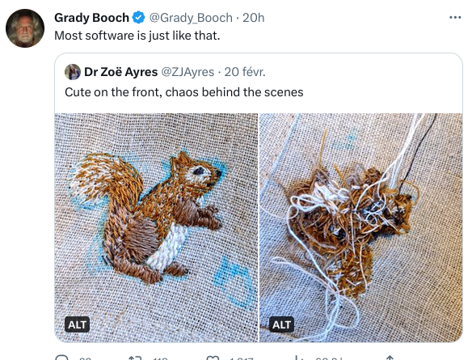
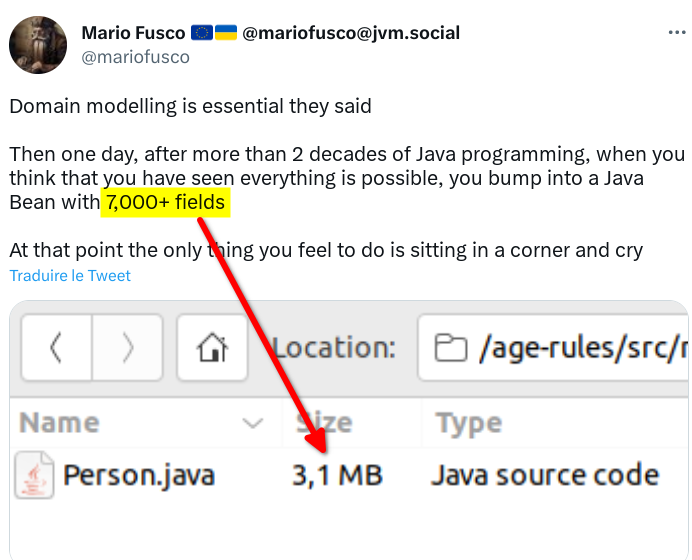
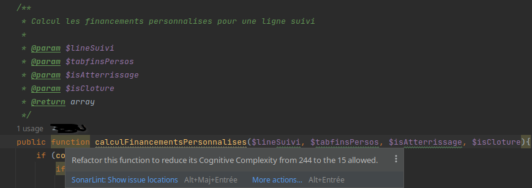

:source-highlighter: highlightjs
:icons: font
:revealjs_theme: solarized

= Quand le code nous hérisse, pas que, le poil

Nolwenn Doucet — Développeur depuis 5 ans

J’aime le vélo, le métal et je suis docteur en sciences des matériaux.

Orga des crafters de Lyon

== Nos logiciels présentent bien

[.stretch]

=== Nos logiciels terrifient

=== Nos logiciels éclopés

[%step]
* Logique métier dispersée
* Le couplage aux frameworks ou bibliothèques tierces
* Les switch case au milieu de boucles imbriquées
* Héritage sur 8 générations
* monObjet.getMachin().getBidule().getChouette().getFoo()

== Les cris d’épouvante

[%notitle]
image::images/wtf-per-minutes.png[code-review]

== L’odeur du code

image::images/smells.png[code-smells]

=== Mutable data

[,java]
----
class Cart {
 private Collection<Product> products = new ArrayList<>();
 private float total = 0;

 public void add(Product product, int quantity){
  products.push(product);
  total += product.price * quantity;
 }
}
----

=== Long parameter list, primitive obsession

[,php]
----
public function transfertMoney(
    string $debtor, <.>
    string $creditor, <.>
    int $amount, <.>
    int $timestamp, <.>
    boolean $repeat = false,
    int $times = 0,
    int $delay = 0): void
{
    …
}
----

=== Magic value

[%linenums,javascript]
----
if(product.type === 'alcool' && user.age >= 18){
  cart.add(product);
}
----

== Sentir les mauvaises odeurs

=== Avec des outils

* SonarLint

* Tout ce qui est linter (eslint, spotbugs, php-md, etc.)

=== Avec des katas

En solo, en duo ou plus si affinité

* Gilded Rose
* Tennis Kata
* Movie Rental
* MarsRoverKataRefactoring (<- il est top celui-ci)
* etc.

== C’est la lutte aka le refactoring

image::images/kent-beck.png[Notre maître à tous]

=== On sort l’IDE 

L’effet démo va-t-il arriver ?

=== Utiliser les outils de son IDE 

Extract variable:: Évite une répétition locale ou permet d’injecter une variable dans une fonction
Inline:: Supprimer une variable ou une fonction en l’utilisant directement

=== Et d’autres encore

* Invert if
* Change signature
* …

== À retenir

* Pensez à la personne qui lira votre code
* Apprenez à utiliser les outils de refactoring
* Tester automatiquement pour refactorer sans crainte

== Ressources

https://martinfowler.com/books/refactoring.html

https://github.com/nicoespeon/abracadabra/blob/main/REFACTORINGS.md

https://github.com/emilybache

https://www.meetup.com/fr-FR/Software-Craftsmanship-Lyon/

