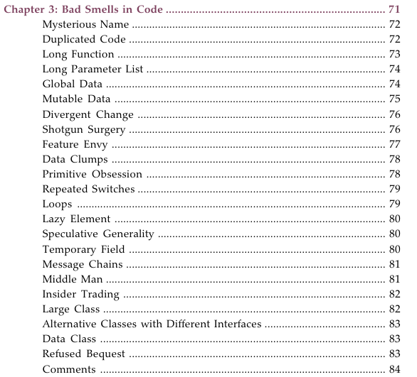
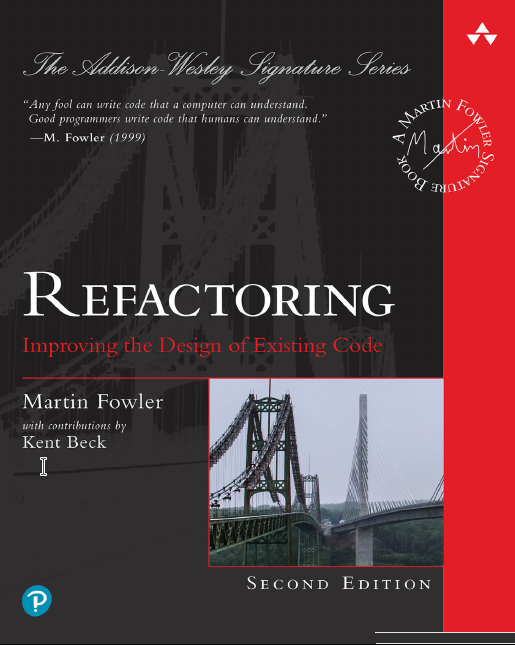
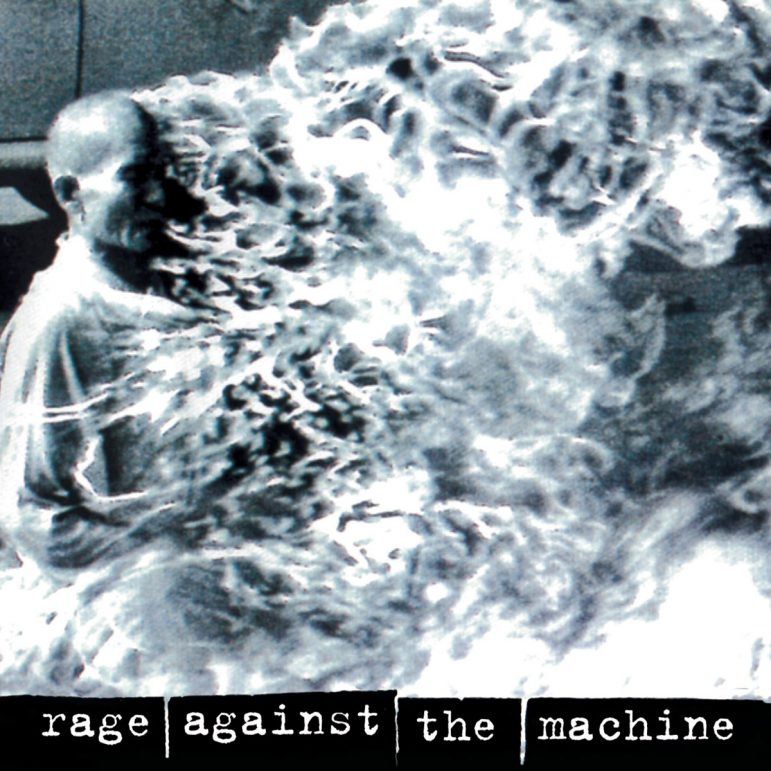
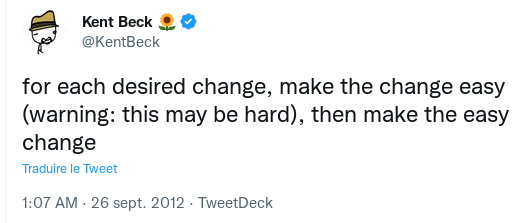

= Le bruit et l’odeur du code

Nolwenn Doucet — Développeur depuis 5 ans

J’aime le vélo, l’apéro et le métal qui tache

Orga des crafters de Lyon

== Le bruit du code…

[.stretch]
image::images/wtf-per-minutes.png[Niveau d’excellence du code produit]

== L’odeur du code, ça se sent

[.stretch]

[%notitle]
=== L’odeur du code, ça se sent

== L’odeur du code, ça se sent que c’est toi

* Logique métier dispersée
* Le couplage au framework
* Les entités anémiques qui se promènent de partout
* Héritage sur 8 générations
* Les champs de la bdd exposés au public
* `monObjet.getMachin().getBidule().getChouette().getFoo()…`

== Know your enemy

11/03/1992 (et oui, 30 ans bordel)

=== Avec son IDE ou la CI

* Sonar et compagnie
* Tout ce qui est linter (eslint, spotbugs, php-md, etc.)

=== Avec des katas

En solo, en duo ou plus si affinité

* Gilded Rose
* Tennis Kata
* Theatrical Player
* Movie Rental
* MarsRoverKataRefactoring (<- il est top celui-ci)
* etc.

=== Avec des club de lecture de code

* https://codereading.club/
* https://www.felienne.com/archives/6472

=== Avec des cartes mémoires

Entrainer son cerveau à reconnaitre des formes ou des motifs

https://www.youtube.com/watch?v=H3L0aN9KItA (Llewellyn Falco)

== C’est la lutte

Contre la complexité accidentelle

